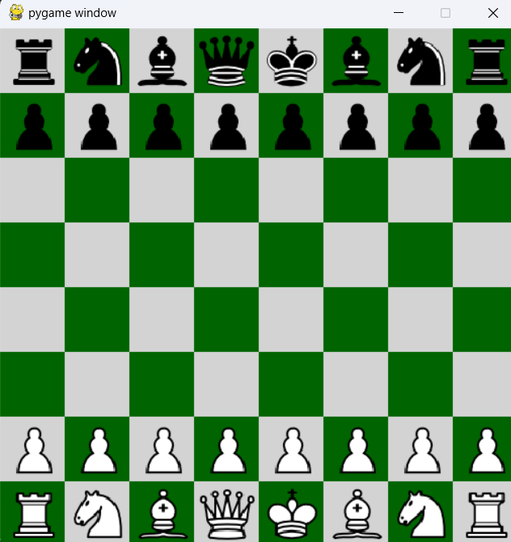

# Chess Game



## Overview

This is a classic chess game built using Pygame, featuring both player vs player and player vs AI modes. The AI is powered by the Minimax algorithm, allowing for a challenging and engaging experience.

## Features

- **Player vs Player Mode:** Play against another human on the same computer.
- **Player vs AI Mode:** Challenge the computer, with AI decisions driven by the Minimax algorithm.
- **Smooth Animations:** Enjoy smooth piece movement and intuitive controls.
- **Undo Move:** Take back your moves to correct mistakes or rethink your strategy.
- **Check, Checkmate, and Stalemate Detection:** The game accurately identifies and handles all critical game states.

## Installation

To run this chess game on your local machine, follow these steps:

1. **Clone the Repository:**
   ```bash
   git clone https://github.com/jindal2004keshav/Chess.git
   cd Chess
   
2. **Install Dependencies: Ensure you have Python and Pygame installed. Then, install the required packages:**
   ```bash
   pip install pygame
   
3. **Run the Game:**
   ```bash
   python ChessMain.py

## AI Implementation

The AI uses the Minimax algorithm with alpha-beta pruning to evaluate potential moves. This ensures that the AI makes optimal decisions by minimizing the possible loss for the worst-case scenario.

## Contributing

Contributions are welcome! If you find a bug or have a suggestion for improvement, please open an issue or submit a pull request.
